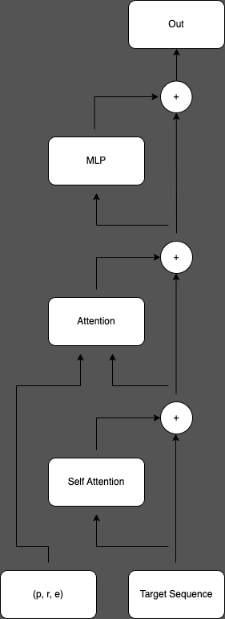
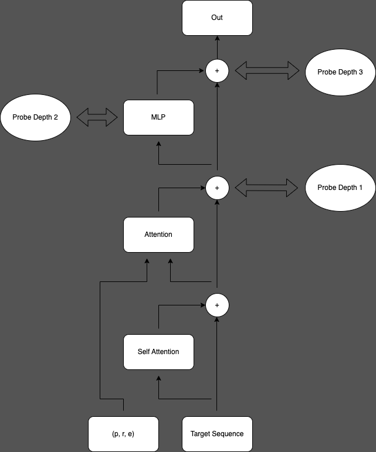
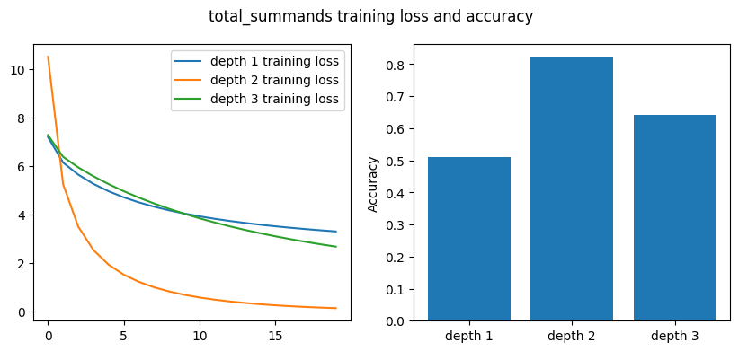
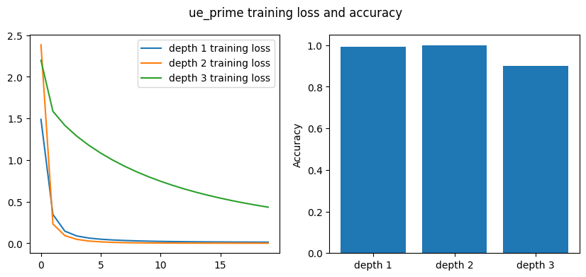
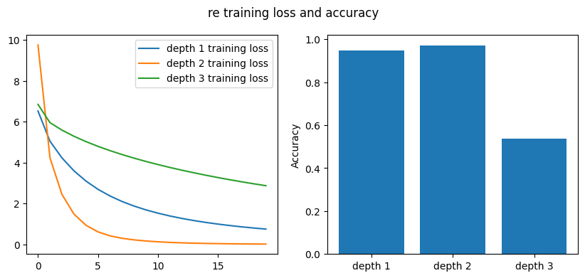
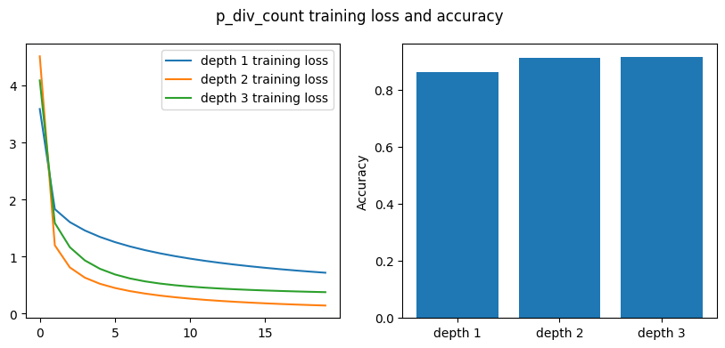
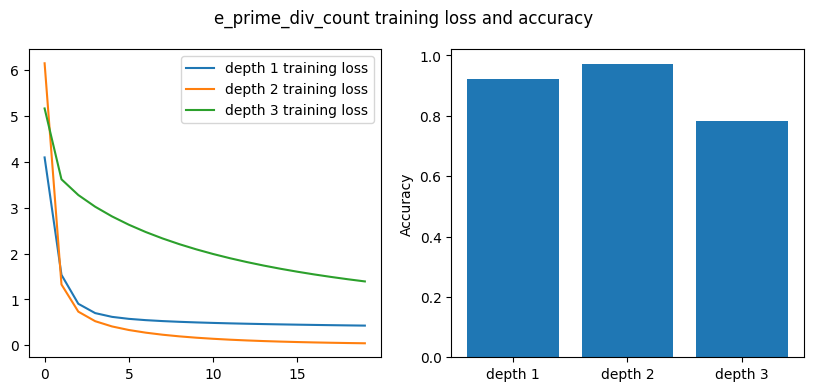
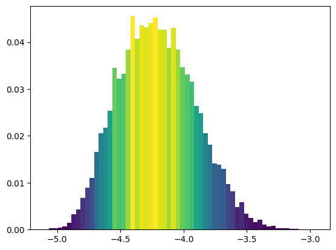
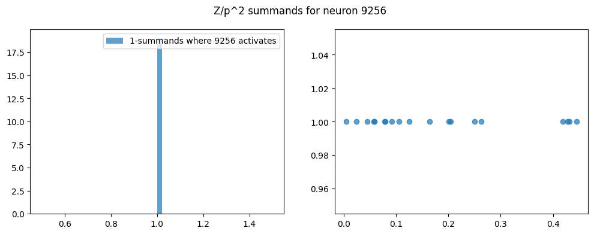

# Applying mechanistic interpretability to algebraic K Theory 

This is part of an ongoing project to apply machine learning to the computation of algebraic $K$-theory.

# Table of Contents
1. [What is algebraic K-theory?](#k-theory)
2. [Goals of the project](#goals)
3. [Data collection](#data)
     1. [Computational considerations](#gooddata)
4. [Model architecture and training](#model)
5. [Probing experiments](#probes)
      1. [Location of probes](#locations)
      2. [Results](#results)
6. [Identifying features](#feats)
      1. [Training a sparse autoencoder](#encoder)
      2. [Inperpreting features](#interp)
7. [Next steps](#next)

 <h2> What is algebraic K-theory?  </h2> 

Algebraic $K$-theory is a mathematical invariant of rings, algebraic varieties, or more general mathematical objects depending on the context. Given a ring $R$, algebraic $K$-theory assigns to $R$ a sequence of abelian groups
   $$K_{r}(R), r \in \mathbb{N}$$
which captures deep arithmetic and geometric information regarding the ring $R$.

The modern version of algebraic K-theory was introduced by Daniel Quillen in 1971, for which he was awarded the Fields medal. Since its introduction, algebraic K-theory has become a central topic of investigation within the mathematical community, playing a crucial role in many open conjectures that connect widely disparate fields of math. Despite its importance, the actual computation of algebraic K-theory remains highly mysterious. For example, we still don't know how to describe the algebraic K-theory of the integers, $\mathbb{Z}$.

Classical results of Hesselholt and Madsen as well as recent advances of Antieau, Krause, and Nikolaus have made possible the collection of a large dataset describing the algebraic $K$-theory of a certain class of rings. The goal of this project is to bring to bear the techniques of deep learning to this newly available data and hopefully extract new insights in to the nature of the this enigmatic mathematical invariant.

 <h2> Goals of the Project </h2>

The goal of this project is to produce a dataset describing the algebraic $K$-theory of truncated polynomial rings, train a very small transformer model to predict the $K$-groups from simple numerical invariants of the input, and then apply interpretability techniques to the internals of the trained transformer to see if we can reconstruct known mathematical properties of algebraic $K$-theory.

The hardest part of this is the interpretability work. Ideally, we would like to reconstruct Algorithm 1 below (or something equivalent) by analyzing the weights of the network, but as of now I am pretty far away from this goal.

Moreover, the class of truncated polynomial rings is really a toy case for the class of finite chain rings, whose algebraic $K$-theory appears within reach thanks to recent advances of Antieau, Krause, and Nikolaus. It seems possible that the methods described here may aid cutting edge research on algebraic $K$-theory if they can be fleshed out enough.

 <h2> Data Collection  </h2> 

For this stage of the project, we focus our attention on the class of truncated polynomial rings over finite fields:
  $$R = \mathbb{F}_{p}[x]/(x^e)$$
where $p$ is a prime number. In this setting, a classical result of Hesselholt and Madsen allows us to write down the $K$-groups of $R$ by applying a simple algorithm:

<h3> Algorithm 1:</h3> 
<ul>
<li> <b>Input:</b> a prime number $p$, an integer $e$, and an integer $r$ </li>
<li> <b>Output:</b> a list of integers $L = [h_1, ..., h_{l}]$ such that

  $$K_{2r-1}(R, (x)) \simeq \bigoplus_{i=1}^{l} \mathbb{Z}/p^{h_{i}}\mathbb{Z}$$</li>
</ul>
<ol>
  <li> Find the unique pair of integers $(u, e')$ such that $e'$ is not divisible by $p$ and $e = p^{u}e'$. </li>
  <li> Initialize an empty list $L$ and loop through all integers $m$ in the range $(1, re)$, performing the following steps:
      <ul>
        <li> If $m$ is divisible by $p$, move to the next step of the loop. </li>
        <li> Find the unique integer $s$ such that $p^{s-1} m \leq re < p^{s}m$. </li>
        <li> If $m$ is  divisible by $e'$, add the minimum of $\{u, s\}$ to $L$.</li>
        <li> If $m$ is not divisible by $e'$, add $s$ to $L$. </li>
      </ul>  
  <li> Return the list $L$. </li>
</ol>

Understanding why this algorithm works requires significant mathematical background (for the adventurous reader, this is equivalent to combining Theorem 1 and Lemma 2 in Martin Speirs' paper 'On the K-Theory of Truncated Polynomial Rings Revisited'). On the other hand, if we accept the validity of this algorithm, it gives us a means to produce a sequential dataset describing the $K$-groups of truncated polynomial rings. In particular, we can train a transformer/RNN/LSTM to auto-regressively predict the algebraic $K$-groups of truncated polynomial rings.

<h3> <ins>Computational Considerations </ins> </h3>
We now describe some of the considerations that go in to using this algorithm to produce a dataset which allows us to efficiently and accurately train an autoregressive model.
In particular, we create a dataset whose labels differ slightly from the list given as the output of Algorithm 1 (to decrease the sequence length when we generate large datasets) and discuss the importance of including a large number of primes in the dataset.

Transformers involve a self-attention mechanism whose time complexity is quadratic in the sequence length. It's thus extremely important to make sure the sequences we feed in to our model are not prohibitively long. 

<h4> <ins>Decreasing the Sequence Length in Exchange for Larger Vocabulary </ins></h4>

Note that in the algorithm above, we loop through all integers $m \in (1, re)$ and for each $m$ which is not divisible by $p$, we add an item to out list. The result is a list that is of length $re - \lfloor \frac{re}{p}\rfloor$. Since $r$ and $e$ will vary throughout the dataset, we will have sequences of varying sizes which we will pad to the maximal sequence length, which is given by
  $$\text{naive max sequence length} = r_{\text{max}} \cdot e_{\text{max}} - \lfloor \frac{r_{\text{max}} \cdot e_{\text{max}}}{p} \rfloor$$
How reasonable is it to take this as our sequence length? Well, the dataset that I use during training has two million examples, with $r_{\text{max}} = 100$ and $e_{\text{max}} = 50$, so with this formulation our sequence length would be approximately 5000 tokens long! This is an extremely large context length for a transformer since the self attention mechanism involves $O(n^2)$ operations for a sequence of length $n$.

On the other hand, our vocabulary size (i.e. the number of possible integers that could show up in the sequence) is equal to the base $p$ logarithm of $r_{\text{max}} \cdot e_{\text{max}}$. Since $p$ varies, we will bound this by taking the smallest $p$ in our dataset which is $p = 2$. This gives us
  $$\text{naive vocabulary size} = \lceil log_{2}(r_{\text{max}} \cdot e_{\text{max}}) \rceil$$
which is extremely small!

The key insight here is that we can relabel our data by counting the number of words that show up in the algorithm. So our labelling procedure can be reformulated as:
<ul> 
<li> Input: triples of integers $(p, r, e)$</li>
<li> Label: list $L' = [n_1, n_2,..., n_k]$ where $n_i$ is the number of occurrences of $i$ in the list $L$ obtained from Algorithm 1. </li>
</ul>

With these new labels we effectively exchange the vocabulary size and sequence length, yielding a dataset which is far more amenable to autoregressive techniques.
$$\text{new max sequence length} = \lceil log_{2}(r_{\text{max}} \cdot e_{\text{max}}) \rceil$$
$$\text{new vocabulary size} = r_{\text{max}} \cdot e_{\text{max}} - \lfloor \frac{r_{\text{max}} \cdot e_{\text{max}}}{p} \rfloor$$

<h4> <ins>Varying p as We Scale The Dataset </ins></h4>

In order to create a dataset, we need only specify a collection of prime numbers $\{p\}$, and collections of integers $\{r\}, \{e\}$. We then apply Algorithm 1 to each triple $(p,r,e)$ and reformat the labels as described above. The resulting size of the dataset $D$ is obtained by multiplying the sizes of these three sets:
  $$\text{len}(D) =  \text{number of primes} \cdot \text{number of }r \cdot \text{number of }e$$
If we fix the size of dataset (say, at two million examples), there are thus many different ways to generate these examples. For example, we could fix a single prime $p$, vary $r$ between 1 and 2000, and vary $e$ between 1 and 1000. 

Notice that the choice of these sets also determines the vocabulary size and sequence length. So in the above example, we would produce a dataset with vocabulary size given by $2000000 - \lfloor 2000000/p \rfloor$, and a sequence length of $log_{p}(2000000)$. While the sequence length is fairly reasonable, the vocabulary size is massive (more than a million words)!

Alternatively, we can achieve the same size of dataset with far smaller vocabulary size and sequence length by varying the primes $p$. We will take our set of primes to consist of the first 400 primes, allow $r$ to range between $1$ and $100$, and allow $e$ to range between $1$ and $50$. This yields a dataset such that
  $$\text{sequence length} = \lceil log_{2}(5000) \rceil = 13$$
  $$\text{vocabulary size} \leq 5000$$
This is a massive improvement over a more naive implementation and highlights the necessity of varying the prime $p$.

<h2>Model Architecture and Training </h2>

The following is all implemented in the jupyter notebook 'training.ipynb'.

We use a basic transformer model, following the paper 'Attention is All You Need'. Each layer consists of a masked self attention mechanism applied to the target sequence (to which we append a start token of 0 for padding), followed by an attention mechanism where the queries and keys arise from the input values $(p, r, e)$. The residual stream is then fed through a single-hidden-layer MLP. After each of the two attention mechanisms and the MLP layer, we apply dropout to the output of the layer, add the output back in to the residual stream and apply a layer normalization. The final operation is to linearly project the residual stream to the logits of a categorical distribution of size $(\text{sequence length}, \text{vocabulary size})$.

For now, we will focus our attention on the following hyperparameter setup:
<ul>
   <li> Number of Attention Heads = 8 </li>
   <li> Dropout Value = 0.1 </li>
   <li> Number of Layers = 1 </li>
   <li> Embedding Dimension = 256</li>
   <li> Dimension of MLP = 1024</li>
   <li> Vocabulary Size = 5000 (from the data)</li>
   <li> Sequence Length = 14 (from the data)</li>
</ul>

 

<h3> <ins> Results </ins></h3>

We generate a dataset of 2 million examples (as described in the previous section) and create a train/validation split of 160,000/40,000. We train the model with the Adam optimizer with a learning rate of .0001. Without adjusting any further hyperparameters, we are able to achieve a classification accuracy of over 98% on the validation set within 60 epochs.

<h2> Probing Experiments </h2>

**Note:** These experiments were performed on a model which achieved 94% validation accuracy. The newest version of the model attains 98% validation accuracy, but these experiments have not been performed on this more accurate model.

Our first tool to understand the internals of the trained model is to insert linear probes at various points within the model. Algorithm 1 gives us a wealth of features to probe for. As we will see, various features of relevance to the algorithm which generated the dataset become linearly accessible to the activations at different points of the model. By detecting these locations within the model and tracking which features the model appears to learn, we begin to get a sense of how the model is performing its computation.

<h3><ins> Location of Probes</ins> </h3>

There are three points in the model where we probe the activations for different features: after the residual connection following the two attention mechanisms, the hidden layer of the MLP, and at the residual connection following the MLP.

All probing experiments will be performed with linear probes and the probing experiments are all classification tasks. See the next section for explicit descriptions of these tasks.

Notice that at this last probe point, the model can linearly access the true solution with 94% accuracy. 

 

<h3> <ins> Description of Experiments and Results </ins></h3>

<h4> <ins> The 'total_summands' probe: </ins> </h4>

Consider a labelled datapoint $(p, r, e), (h_{1},..., h_{k})$. The 'total_summands' probing objective is the sum
   $$\text{target} = \sum_{i=1}^{k} h_{i} $$
which is the $p$-based logarithm of the order of $K_{2r-1}(\mathbb{F}_{p}[x]/(x^e)$. This could be useful information for an autoregressive model for a variety of reasons and is a mathematically compelling feature of the data. 

We view this as a classification problem whose number of classes is the vocabulary size of the dataset.

The model appears to not utilize this information, as we cannot successfully probe for it at any layer of the model.

<h4> <ins> The 'ue_prime' probe: </ins></h4>

One of the first steps in Algorithm 1 above is to extract two numerical features from $(p, r, e)$ - namely $u$ and $e'$, which are characterized by the property that $e'$ is not divisble by $p$ and $e = p^{u} e'$. Since these are crucial ingredients within the algorithm and are intimately related to one another (it seems implausible to find one of these numbers without finding the other as a natural byproduct), we probe for both of these simultaneously. 

   $$\text{target} = (u, e') $$

We view this as a classification problem with 2 class dimensions and 41 classes in each dimension (since the largest possible value of $e'$ is 40 in the probe dataset).

The model appears to successfully learn this feature (with >99% accuracy) by the first probe point, thus only relying on the attention mechanism to extract it.

<h4> <ins> The 're' probe:</ins></h4>

Another crucial ingredient in Algorithm 1 is the computation of $r*e$. Note that multiplication tends to be non-trivial for neural networks to learn.
   $$\text{target} = re$$

We view this as a classification task whose number of classes is the vocabulary size of the dataset.

The model appears to successfully learn this feature.

<h4> <ins> The 'p_div_count' probe:</ins></h4>

Algorithm 1 makes use of the set of integers in the interval $[1, re]$ which are not divisible by $p$. We would like to probe for this information, but since we have altered Algorithm 1 to form a computationally convenient dataset, we should similarly recast the problem of finding this set of integers to a form which is comparable to the task we have trained the model on. Whereas Algorithm 1 makes use of a function $h$ on this set, our reformulation of the labels only counts the size of the preimage of this function. So we should similarly count the number of integers in the interval $[1, re]$ which are not divisible by $p$.

   $$\text{target} = \text{number of integers } m \in [1,re] \text{ which are divisible by } p.$$

We view this as a classification task whose number of classes is the vocabulary size of the dataset.

The model appears to successfully learn this feature.

<h4> <ins> The 'e_prime_div_count' probe:</ins></h4>

Algorithm 1 makes use of a function $h$ on the set $\{m \in [1, re] \big| (m,p) =1\}$ and the function is piecewise defined based on whether or not $m$ is divisible by $e'$. Following the reasoning in the discussion of the previous probe, we should count the number of these integers which are divisble by $e'$.
 
   $$\text{target} = \text{number of integers } m \in [1,re] \text{ which are divisible by } e'.$$

We view this as a classification task whose number of classes is the vocabulary size of the dataset.

The model appears to successfully learn this feature.

<h4> <ins> Some Observations </ins></h4>

In several of the above cases, the model learns a feature at some layer and then appears to forget this information by the final layer. This could suggest that the feature has served its purpose in some intermediate calculation by the final residual connection and the model has chosen to overwrite any information dedicated to that feature. Another possibility is that the feature simply isn't important to the model's functioning, and we are able to successfully probe for it incidentally. Additional work is needed to investigate this.

<h2> Identifying features </h2>

The probing experiments give us some insight in to the global behavior of the internal activations of the trained transformer. On the other hand, they suffer from two drawbacks:
<ul>
   <li> They require us to know what features we're looking for in advance (and thus are of limited help in contexts where our understanding is limited). </li>
   <li> They don't offer insight in to how the model is using the features in downstream tasks. </li>
</ul>

One recent approach to interpreting learned features that overcomes both of these weaknesses is through training a sparse autoencoder to reconstruct the internal activations of the model. This is motivated by the theory of superposition and has resulted in some really excellent interpretability work (Bricken et. al. and Cunningham et. al.).

We are going to investigate this approach in our setting, training a sparse autoencoder to extract learned features from the hidden layer of the MLP in our model. We will then attempt to interpret these learned features and compare them to our knowledge of K-theory.

<h3> Training a sparse autoencoder  </h3>

We train an autoencoder on the hidden layer of the MLP with latent dimensions of 8192, and 16384 for 5 and 10 epochs. Our architectural strategies follow the paper 'Towards Monosemanticity: Decomposing Language Models With Dictionary Learning' by Bricken et. al. Denoting by $x$the activations of the model at the hidden layer, the autoencoder is given by
  $$ \overline{x} = x - b_{dec}$$
  $$ z = ReLU(W^{enc}\overline{x} + b_{enc})$$
  $$\hat{x} = W^{dec}z + b_{dec}$$

The system is clearly overdetermined, so we enforce some additional constraints:
<ul>
   <li> Let $x$ denote the activations of the neural network at the hidden layer, $z$ be the latent variable, and $x_{rec}$ denote the reconstructed activations from the decoder of the autoencoder. The training objective is given by $MSE(x_{rec}, x) + \lambda ||z||_{1}, where $\lambda$ is a hyperparameter known as the *sparsity*. In particular, the model is encouraged to activate as few of the coordinates of $z$ as possible while still accurately reconstructing the activations. </li>

   <li> The autoencoder can overcome the sparsity construct by scaling a sparse latent variable in the decoding stage. To prevent this maladaptive strategy, we enforce that the columns of $W^{dec}$ to be of unit norm. This imposes constraints on the gradients of the decoder (namely that the gradient is in fact orthogonal to the weights themselves - fun exercise in identifying the tangent bundle of the unit sphere) which we manually impose after every backward pass.  </li>
</ul>

For the current round of experiments, the autoencoder is trained using a random subset of 700,000 examples from the data used to train the model (we couldn't use all 2,000,000 due to memory constraints). Every epoch, we measure the portion of training samples on which each coordinate in the latent variable activates. 

For the model with 16384 neurons trained with a sparsity value of $.001$, the log-density of the neuron activations after 5 epochs is given below.

Unlike Bricken et. al., we actually don't obtain a bimodal distribution, seeming to completely avoid the 'ultra-low density cluster' of loc. cit. This doesn't feel especially surprising given how fundamentally different the models and data are.

<h3> Interpreting individual neurons </h3>

Many of the learned features activate in response to highly specific contexts which correspond to semantically meaningful attributes of the underlying data.

In order to speed up experiments, all the interpretability experiments referenced below are performed on 200,000 training samples across the first 200 primes. The maximal sequence length for this dataset is 8.

<h4> Location Specific Neurons </h4>

Unlike the case of language modeling, the position of a given token in our data has a fixed meaning - it counts the number of summands in the $K$-groups of the input. As such, one might expect that the model learns features that are specific to a certain context.

Indeed, the autoencoder learns to devote hundreds of neurons to activating almost exclusively (>90% of the time) to tokens in a certain position. 

For example, neuron 2047 fires exclusively at position 0, neuron 9143 fires exlcusively at position 1, neuron 5857 fires exclusively at the 7th position (i.e. the last position in the sequence. Curiously, positions 3-6 exhibit far lesser neuron specialization. For the neurons which specialize the most to these positions, the given position only accounts for 48%,  44%, 27% and 36% of the neurons fires respectively. I hypothesize that this is because of the natural sparsity of data in these regions: the vast majority of the datapoints only have non-zero summands in the first 2-3 positions making it difficult to detect salient features at later positions. 

<h4> Interpretable Neurons </h4>

The location specific neurons often exhibit interpretable behavior. I'm in the process of organizing the learned features in to a compelling story right now so I won't say much here. For now, I will simply give an example of a highly specific feature.

Neuron 9256 fires exclusively at the first position, and so its effect on the output logits will govern the model's predictions for the number of $\mathbb{Z}/p^{2}$ summands present in the $K$-theory. Intriguingly, neuron 9256 fires exclusively on datapoints where there is a single $\mathbb{Z}/p^2$ summand. Such datapoints only account for about 3% of all the examples in the data.

                       

Moreover, due to the auto-regressive mask in the transformer model, the neuron doesn't have access to any information about the number of $\mathbb{Z}/p^2$ summands other than information implicitly present in the input.

<h2> Next steps </h2>

The probing experiments listed above begin to give some insight in to the inner workings of the $K$-theory transformer, but we're still a ways off from being able to 'reverse engineer' the underlying algorithm (a success here would be to recover an algorithm equivalent to Algorithm 1 which was comparably simple and demonstrate that the transformer was essentially carrying out this algorithm). Ultimately, this is a test case that we hope to apply to situations where the analogue of Algorithm 1 is not known, so we will also need to consider ways of discovering the salient features used by the model without knowing them in advance.

<h3> <ins> Interventional Experiments for Hypothesis Testing </ins></h3>

The probing experiments allow us to formulate hypotheses about the output of the model and we could test these hypotheses by intervening on the activations. 

<ins> Example: </ins> We know the model has access to the parameter $u$ and can count the number, $N_{true}$, of integers $m \in [1, re]$ which are divisible by $e'$ but not by $p$. Given our knowledge of Algorithm 1, it's reasonable to hypothesize that the model uses this number to increase the logit corresponding to $u$ in the output by a factor proportional to the number of integers in this count. To test this, we could intervene on the activations at the MLP layer altering them to correspond to a different count
     $$N_{true} \to N_{intervened}. $$
We could then forward these altered activations through the model and measure the change in the logits at output. If our hypothesis is correct, we should be able to connect the change in the feature $\Delta N = |N_{true} - N_{intervened}|$ to a change in the logits corresponding to $u$.

Performing these interventional experiments will require some additional tooling to be built. This is in progress.

<h3> <ins> Additional Probing Experiments </ins></h3>

In order to arrive at a set of hypotheses which encompass the entirety of Algorithm 1 and thus could, in theory, be responsible for a mechanistic description of the model, we will need to expand the set of probing experiments. The tooling for this is already built and a more thorough set of probing experiments is in development.

<h3> <ins> Detecting Salient Features in Other Settings </ins></h3>

Ultimately, we would like to train a similar model on a broader dataset which encompasses input where Algorithm 1 is no longer valid. In particular, we would like to discover features that are relevant to the computation of algebraic $K$-theory more generally. There are several recent papers (e.g. 'Towards Monosemanticity: Decomposing Language Models With Dictionary Learning' Bricken et. al and 'Sparse Autoencoders Find Highly Interpretable Model Directions' by Cunningham et. al.) which provide a framework for approaching such problems. I am currently carrying out such experiments in the toy case of truncated polynomial rings.

